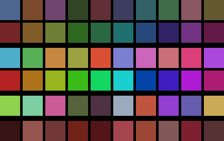

# swift-colorful

A library for playing with colors in Swift. Supports Swift 5.6 onwards.

This library has been ported from Golang to Swift by Artur Torun (a.k.a. Mojzesh)

Original library called `go-colorful` has been written by Lucas Beyer and can be found here: https://github.com/lucasb-eyer/go-colorful

**Note:** *Vast amount of the below text and examples have been copied from README.md file: https://github.com/lucasb-eyer/go-colorful*

Why?
====
I've made this Swift port of the library as I was migrating my 3D graphics engine from `Go + Vulkan` to `Swift + Metal`.
I love this library and I'm impressed how well it has been crafted, and I really think it's useful in many applications. I couldn't find anything in Swift which would get any closer to this library. It took me one day to port 80% of the code and then another week to port the rest (with sorting being the trickiest one to port). The only thing that is missing compared to original implementation is the support for HEX colors encoding/decoding where the input / output is SQL database or JSON processor. But you can still create colors based on web HEX RGB strings (short and full formats are supported).

This is what the original author of go-colorful has said:

*I love games. I make games. I love detail and I get lost in detail.
One such detail popped up during the development of [Memory Which Does Not Suck](https://github.com/lucasb-eyer/mwdns/),
when we wanted the server to assign the players random colors. Sometimes
two players got very similar colors, which bugged me. The very same evening,
[I want hue](http://tools.medialab.sciences-po.fr/iwanthue/) was the top post
on HackerNews' frontpage and showed me how to Do It Right™. Last but not
least, there was no library for handling color spaces available in go. Colorful
does just that and implements Go's `color.Color` interface.*

What?
=====
Go-Colorful stores colors in RGB and provides methods from converting these to various color-spaces. Currently supported colorspaces are:

- **RGB:** All three of Red, Green and Blue in [0..1].
- **HSL:** Hue in [0..360], Saturation and Luminance in [0..1]. For legacy reasons; please forget that it exists.
- **HSV:** Hue in [0..360], Saturation and Value in [0..1]. You're better off using HCL, see below.
- **Hex RGB:** The "internet" color format, as in #FF00FF.
- **Linear RGB:** See [gamma correct rendering](http://www.sjbrown.co.uk/2004/05/14/gamma-correct-rendering/).
- **CIE-XYZ:** CIE's standard color space, almost in [0..1].
- **CIE-xyY:** encodes chromacity in x and y and luminance in Y, all in [0..1]
- **CIE-L\*a\*b\*:** A *perceptually uniform* color space, i.e. distances are meaningful. L\* in [0..1] and a\*, b\* almost in [-1..1].
- **CIE-L\*u\*v\*:** Very similar to CIE-L\*a\*b\*, there is [no consensus](http://en.wikipedia.org/wiki/CIELUV#Historical_background) on which one is "better".
- **CIE-L\*C\*h° (HCL):** This is generally the [most useful](http://vis4.net/blog/posts/avoid-equidistant-hsv-colors/) one; CIE-L\*a\*b\* space in polar coordinates, i.e. a *better* HSV. H° is in [0..360], C\* almost in [0..1] and L\* as in CIE-L\*a\*b\*.
- **CIE LCh(uv):** Called `LuvLCh` in code, this is a cylindrical transformation of the CIE-L\*u\*v\* color space. Like HCL above: H° is in [0..360], C\* almost in [0..1] and L\* as in CIE-L\*u\*v\*.
- **HSLuv:** The better alternative to HSL, see [here](https://www.hsluv.org/) and [here](https://www.kuon.ch/post/2020-03-08-hsluv/). Hue in [0..360], Saturation and Luminance in [0..1].
- **HPLuv:** A variant of HSLuv. The color space is smoother, but only pastel colors can be included. Because the valid colors are limited, it's easy to get invalid Saturation values way above 1.0, indicating the color can't be represented in HPLuv because it's not pastel.

For the colorspaces where it makes sense (XYZ, Lab, Luv, HCl), the
[D65](http://en.wikipedia.org/wiki/Illuminant_D65) is used as reference white
by default but methods for using your own reference white are provided.

A coordinate being *almost in* a range means that generally it is, but for very
bright colors and depending on the reference white, it might overflow this
range slightly. For example, C\* of #0000ff is 1.338.

Unit-tests are provided.

Nice, but what's it useful for?
-------------------------------

- Converting color spaces. Some people like to do that.
- Blending (interpolating) between colors in a "natural" look by using the right colorspace.
- Generating random colors under some constraints (e.g. colors of the same shade, or shades of one color.)
- Generating gorgeous random palettes with distinct colors of the same temperature.

So which colorspace should I use?
=================================
It depends on what you want to do. I think the folks from *I want hue* are
on-spot when they say that RGB fits to how *screens produce* color, CIE L\*a\*b\*
fits how *humans perceive* color and HCL fits how *humans think* colors.

Whenever you'd use HSV, rather go for CIE-L\*C\*h°. for fixed lightness L\* and
chroma C\* values, the Hue angle h° rotates through colors of the same
perceived brightness and intensity.

How?
====

### Installing
Installing the library is as easy as:
A) From CLI, adding the following snippet to your `Package.swift` file:
- `.package(url: "https://github.com/mojzesh/swift-colorful.git", from: "1.0.0")`

B) In Xcode, just use:
- Click menu option: `File -> Add Packages...`
- paste URL: `https://github.com/mojzesh/swift-colorful.git` in the right top corner: `Search or Enter Package URL`

The package can then be used through this:
```swift
import Colorful
```

To run demo projects from CLI:
- `swift run DemoColorBlend-macOS`
- `swift run DemoColorDist-macOS`
- `swift run DemoColorGens-macOS`
- `swift run DemoColorSort-macOS`
- `swift run DemoGradientGen-macOS`
- `swift run DemoPaletteGens-macOS`

To run tests:
- `swift test`

To run benchmark:
- `swift run Benchmark-macOS`

### Basic usage

Create a beautiful blue color using different source space:

```swift
import Colorful

// Any of the following should be the same
var c = Color(R: 0.313725, G: 0.478431, B: 0.721569)
do {
    c = try Color.Hex("#517AB8")
} catch let error {
    print("\(error)")
}

c = Color.Hsv(H: 216.0,    S:  0.56,     V:  0.722)
c = Color.Xyz(x: 0.189165, y:  0.190837, z:  0.480248)
c = Color.Xyy(x: 0.219895, y:  0.221839, Y:  0.190837)
c = Color.Lab(l: 0.507850, a:  0.040585, b: -0.370945)
c = Color.Luv(l: 0.507849, u: -0.194172, v: -0.567924)
c = Color.Hcl(h: 276.2440, c:  0.373160, l:  0.507849)

let (r, g, b) = c.Values()
print(String(format: "RGB values: %f, %f, %f", r, g, b))

let (r255, g255, b255) = c.RGB255()
print(String(format: "RGB values: %i, %i, %i", r255, g255, b255))
```

And then converting this color back into various color spaces:

```swift
let hex := c.Hex()
let (h, s, v) = c.Hsv()
let (x, y, z) = c.Xyz()
let (x, y, Y) = c.Xyy()
let (l, a, b) = c.Lab()
let (l, u, v) = c.Luv()
let (h, c, l) = c.Hcl()
```

### *This library is trying to keep function naming conventions as close to original `go-colorful` implementation as possible.*

### Comparing colors
In the RGB color space, the Euclidian distance between colors *doesn't* correspond
to visual/perceptual distance. This means that two pairs of colors that have the
same distance in RGB space can look much further apart. This is fixed by the
CIE-L\*a\*b\*, CIE-L\*u\*v\* and CIE-L\*C\*h° color spaces.
Thus you should only compare colors in any of these spaces.
(Note that the distances in CIE-L\*a\*b\* and CIE-L\*C\*h° are the same, since it's the same space but in cylindrical coordinates)


The two colors shown at the top look much more different than the two shown at
the bottom. Still, in RGB space, their distance is the same.
Here is a little example program that shows the distances between the top two
and the bottom two colors in RGB, CIE-L\*a\*b\* and CIE-L\*u\*v\* space. You can find it in `Sources/Demos/ColorDist/main.swift`.

```swift
import Foundation

import Colorful

let c1a = Color(R: 150.0 / 255.0, G: 10.0  / 255.0, B: 150.0 / 255.0)
let c1b = Color(R: 53.0  / 255.0, G: 10.0  / 255.0, B: 150.0 / 255.0)
let c2a = Color(R: 10.0  / 255.0, G: 150.0 / 255.0, B: 50.0  / 255.0)
let c2b = Color(R: 99.9  / 255.0, G: 150.0 / 255.0, B: 10.0  / 255.0)

print(String(format: "DistanceRgb:       c1: %.17f\tand c2: %.17f", c1a.DistanceRgb(c1b), c2a.DistanceRgb(c2b)))
print(String(format: "DistanceLab:       c1: %.17f\tand c2: %.17f", c1a.DistanceLab(c1b), c2a.DistanceLab(c2b)))
print(String(format: "DistanceLuv:       c1: %.17f\tand c2: %.17f", c1a.DistanceLuv(c1b), c2a.DistanceLuv(c2b)))
print(String(format: "DistanceCIE76:     c1: %.17f\tand c2: %.17f", c1a.DistanceCIE76(c1b), c2a.DistanceCIE76(c2b)))
print(String(format: "DistanceCIE94:     c1: %.17f\tand c2: %.17f", c1a.DistanceCIE94(c1b), c2a.DistanceCIE94(c2b)))
print(String(format: "DistanceCIEDE2000: c1: %.17f\tand c2: %.17f", c1a.DistanceCIEDE2000(c1b), c2a.DistanceCIEDE2000(c2b)))
```

Running the above program shows that you should always prefer any of the CIE distances:

```bash
$ swift run DemoColorDist-macOS
Building for debugging...
[3/3] Linking DemoColorDist-macOS
Build complete! (0.38s)
DistanceRgb:       c1: 0.38039215686274508      and c2: 0.38587139311711588
DistanceLab:       c1: 0.32042638877384100      and c2: 0.24395387956805947
DistanceLuv:       c1: 0.51331140446133072      and c2: 0.25683706276058060
DistanceCIE76:     c1: 0.32042638877384100      and c2: 0.24395387956805947
DistanceCIE94:     c1: 0.19795102869625045      and c2: 0.12206359588444481
DistanceCIEDE2000: c1: 0.17271531164545623      and c2: 0.10664280425514172
```

It also shows that `DistanceLab` is more formally known as `DistanceCIE76` and
has been superseded by a slightly more accurate, but much more expensive
`DistanceCIE94` and `DistanceCIEDE2000`.

Note that `AlmostEqualRgb` is provided mainly for (unit-)testing purposes. Use
it only if you really know what you're doing. It will eat your cat.

### Blending colors
Blending is highly connected to distance since it basically "walks through" the
colorspace, thus if the colorspace maps distances well, the walk is "smooth".

Colorful comes with blending functions in RGB, HSV and any of the LAB spaces.
Of course, you'd rather want to use the blending functions of the LAB spaces since
these spaces map distances well but, just in case, here is an example showing
you how the blendings (`#fdffcc` to `#242a42`) are done in the various spaces:


What you see is that HSV is really bad: it adds some green, which is not present
in the original colors at all! RGB is much better, but it stays light a little
too long. LUV and LAB both hit the right lightness but LAB has a little more
color. HCL works in the same vein as HSV (both cylindrical interpolations) but
it does it right in that there is no green appearing and the lighthness changes
in a linear manner.

While this seems all good, you need to know one thing: when interpolating in any
of the CIE color spaces, you might get invalid RGB colors! This is important if
the starting and ending colors are user-inputted or random. An example of where this
happens is when blending between `#eeef61` and `#1e3140`:


You can test whether a color is a valid RGB color by calling the `IsValid` method
and indeed, calling IsValid will return false for the redish colors on the bottom.
One way to "fix" this is to get a valid color close to the invalid one by calling
`Clamped`, which always returns a nearby valid color. Doing this, we get the
following result, which is satisfactory:


The following is the code creating the above three images; it can be found in `Sources/Demos/ColorBlend/main.swift`

```swift
import Foundation
import AppKit

import Colorful
import DemoShared

let blocks = 10
let blockw = 40

let (image, imageRep) = createImageRep(NSSize(width: blocks*blockw, height: 200))

let c1 = try! Color.Hex("#fdffcc")
let c2 = try! Color.Hex("#242a42")

// Use these colors to get invalid RGB in the gradient.
// let c1 = try! Color.Hex("#EEEF61")
// let c2 = try! Color.Hex("#1E3140")

var col = Color()
for i in 0..<blocks {
    col = c1.BlendHsv(c2: c2, t: Float64(i)/Float64(blocks-1))
    drawRect(imageRep: imageRep, rect: NSRect(x: i*blockw, y: 0, width: blockw, height: blockw), color: col)
    col = c1.BlendLuv(c2: c2, t: Float64(i)/Float64(blocks-1))
    drawRect(imageRep: imageRep, rect: NSRect(x: i*blockw, y: 40, width: blockw, height: blockw), color: col)
    col = c1.BlendRgb(c2: c2, t: Float64(i)/Float64(blocks-1))
    drawRect(imageRep: imageRep, rect: NSRect(x: i*blockw, y: 80, width: blockw, height: blockw), color: col)
    col = c1.BlendLab(c2: c2, t: Float64(i)/Float64(blocks-1))
    drawRect(imageRep: imageRep, rect: NSRect(x: i*blockw, y: 120, width: blockw, height: blockw), color: col)
    col = c1.BlendHcl(c2: c2, t: Float64(i)/Float64(blocks-1))
    drawRect(imageRep: imageRep, rect: NSRect(x: i*blockw, y: 160, width: blockw, height: blockw), color: col)

    // This can be used to "fix" invalid colors in the gradient.
    // col = c1.BlendHcl(c2: c2, t: Float64(i)/Float64(blocks-1)).Clamped()
    // drawRect(imageRep: imageRep, rect: NSRect(x: i*blockw,y: 160,width: blockw, height: blockw), color: col)
}

_ = savePNG(image: image, path: "Sources/Demos/ColorBlend/colorblend.png")

```

#### Generating color gradients
A very common reason to blend colors is creating gradients. There is an example
program in [Sources/Demos/GradientGen/main.swift](Sources/Demos/GradientGen/main.swift); it doesn't use any API
which hasn't been used in the previous example code, so I won't bother pasting
the code in here. Just look at that gorgeous gradient it generated in HCL space:


### Getting random colors
It is sometimes necessary to generate random colors. You could simply do this
on your own by generating colors with random values. By restricting the random
values to a range smaller than [0..1] and using a space such as CIE-H\*C\*l° or
HSV, you can generate both random shades of a color or random colors of a
lightness:

```swift
let random_blue =  Color.Hcl(h: 180.0+randomFloat64()*50.0, c: 0.2+randomFloat64()*0.8, l: 0.3+randomFloat64()*0.7)
let random_dark =  Color.Hcl(h: randomFloat64()*360.0,      c: randomFloat64(),         l: randomFloat64()*0.4)
let random_light = Color.Hcl(h: randomFloat64()*360.0,      c: randomFloat64(),         l: 0.6+randomFloat64()*0.4)
```

Since getting random "warm" and "happy" colors is quite a common task, there
are some helper functions:

```swift
WarmColor()
HappyColor()
FastWarmColor()
FastHappyColor()
```

The ones prefixed by `Fast` are faster but less coherent since they use the HSV
space, as opposed to the regular ones which use CIE-L\*C\*h° space. The
following picture shows the warm colors in the top two rows and happy colors
in the bottom two rows. Within these, the first is the regular one and the
second is the fast one.


Don't forget to initialize the random seed! You can see the code used for
generating this picture in `Sources/Demos/ColorGens/main.swift`.

### Getting random palettes
As soon as you need to generate more than one random color, you probably want
them to be distinguishable. Playing against an opponent which has almost the
same blue as I do is not fun. This is where random palettes can help.

These palettes are generated using an algorithm, which ensures that all colors
on the palette are as distinguishable as possible. Again, there is a `Fast`
method which works in HSV and is less perceptually uniform - and a non-`Fast`
method which works in CIE spaces. For more theory on `SoftPalette`, check out
[I want hue](http://tools.medialab.sciences-po.fr/iwanthue/theory.php). Yet
again, there is a `Happy` and a `Warm` version, which do what you expect, but
now there is an additional `Soft` version, which is more configurable: you can
give a constraint on the color space to get colors of a certain *feel*.

Let's start with the simple methods first: all they take is the amount of
colors to generate, which could, for example, be the player count. They return
an array of `colorful.Color` objects:

```swift
do {
    warm = try WarmPalette(10)
} catch {}

let fwarm = FastWarmPalette(10)

do {
    happy = try HappyPalette(10)
} catch {}

let fhappy = FastHappyPalette(10)

do {
    soft = try SoftPalette(10)
} catch {}
```

Note that the non-fast methods *may* fail if you ask for way too many colors.
Let's move on to the advanced one, namely `SoftPaletteEx`. Besides the color
count, this function takes a `SoftPaletteSettings` object as argument. The
interesting part here is its `CheckColor` member, which is a boolean function
taking three floating points as arguments: `l`, `a` and `b`. This function
should return `true` for colors which lie within the region you want and `false`
otherwise. The other members are `Iteration`, which should be within [5..100]
where higher means slower but more exact palette, and `ManySamples` which you
should set to `true` in case your `CheckColor` constraint rejects a large part
of the color space.

For example, to create a palette of 10 brownish colors, you'd call it like this:

```swift
func isbrowny(l: Float64, a: Float64, b: Float64) -> Bool {
	let (h, c, L) = Color.LabToHcl(L: l, a: a, b: b)
	return 10.0 < h && h < 50.0 && 0.1 < c && c < 0.5 && L < 0.5
}
// Since the above function is pretty restrictive, we set ManySamples to true.
do {
    brownies = try SoftPaletteEx(colorsCount: colors, settings: SoftPaletteSettings(checkColorFn: isbrowny, iterations: 50, manySamples: true))
} catch {}
```

The following picture shows the palettes generated by all of these methods
(sourcecode in `Sources/Demos/PaletteGens/main.swift`), in order they were presented, i.e.
from top to bottom: `Warm`, `FastWarm`, `Happy`, `FastHappy`, `Soft`,
`SoftEx(isbrowny)`. All of them contain some randomness, so YMMV.



Again, the code used for generating the above image is available as [Sources/Demos/PaletteGens/main.swift](https://github.com/mojzesh/swift-colorful/blob/master/Sources/Demos/PaletteGens/main.swift).

### Sorting colors

Sorting colors is not a well-defined operation.  For example, {dark blue, dark red, light blue, light red} is already sorted if darker colors should precede lighter colors but would need to be re-sorted as {dark red, light red, dark blue, light blue} if longer-wavelength colors should precede shorter-wavelength colors.

Go-Colorful's `Sorted` function orders a list of colors to minimize the average distance between adjacent colors, including between the last and the first.  (`Sorted` does not necessarily find the true minimum, only a reasonably close approximation.)  The following picture, drawn by [Sources/Demos/ColorSort/main.swift](https://github.com/mojzesh/swift-colorful/blob/master/Sources/Demos/ColorSort/main.swift), illustrates `Sorted`'s behavior:


The first row represents the input: a slice of 512 randomly chosen colors.  The second row shows the colors sorted in CIE-L\*C\*h° space, ordered first by lightness (L), then by hue angle (h), and finally by chroma (C).  Note that distracting pinstripes permeate the colors.  Sorting using *any* color space and *any* ordering of the channels yields a similar pinstriped pattern.  The third row of the image was sorted using Go-Colorful's `Sorted` function.  Although the colors do not appear to be in any particular order, the sequence at least appears smoother than the one sorted by channel.


### Using linear RGB for computations
There are two methods for transforming RGB⟷Linear RGB: a fast and almost precise one,
and a slow and precise one.

```swift
let (r, g, b) = try Color.Hex("#FF0000").FastLinearRgb()
```

TODO: describe some more.

### Want to use some other reference point?

```swift
let c = Color.LabWhiteRef(l: 0.507850, a: 0.040585, b: -0.370945, wref: D50)
let (l, a, b) = c.LabWhiteRef(wref: D50)
```

### Reading and writing colors from databases

- Not implemented

FAQ
===

### Q: I get all f!@#ed up values! Your library sucks!
A: You probably provided values in the wrong range. For example, RGB values are
expected to reside between 0 and 1, *not* between 0 and 255. Normalize your colors.

### Q: Lab/Luv/HCl seems broken! Your library sucks!
They look like this:


A: You're likely trying to generate and display colors that can't be represented by RGB,
and thus monitors. When you're trying to convert, say, `Color.Hcl(h: 190.0, c: 1.0, l: 1.0).RGB255()`,
you're asking for RGB values of `(-2105.254  300.680  286.185)`, which clearly don't exist,
and the `RGB255` function just casts these numbers to `uint8`, creating wrap-around and
what looks like a completely broken gradient. What you want to do is either use more
reasonable values of colors which actually exist in RGB, or just `Clamp()` the resulting
color to its nearest existing one, living with the consequences:
`Hcl(h: 190.0, c: 1.0, l: 1.0).Clamp().RGB255()`. It will look something like this:


[Here's an issue going in-depth about this](https://github.com/lucasb-eyer/go-colorful/issues/14),
as well as [my answer](https://github.com/lucasb-eyer/go-colorful/issues/14#issuecomment-324205385),
both with code and pretty pictures. Also note that this was somewhat covered above in the
["Blending colors" section](https://github.com/lucasb-eyer/go-colorful#blending-colors).

### Q: In a tight loop, conversion to Lab/Luv/HCl/... are slooooow!
A: Yes, they are.
This library aims for correctness, readability, and modularity; it wasn't written with speed in mind.
A large part of the slowness comes from these conversions going through `LinearRgb` which uses powers.
I implemented a fast approximation to `LinearRgb` called `FastLinearRgb` by using Taylor approximations.
The approximation is roughly 5x faster and precise up to roughly 0.5%,
the major caveat being that if the input values are outside the range 0-1, accuracy drops dramatically.
You can use these in your conversions as follows:

```swift
let (R, G, B) = c1.LinearRgb()
let (x, y, z) = Color.LinearRgbToXyz(r: R, g: G, b: B)
let (l, a, b) = Color.XyzToLab(x: x, y: y, z: z)
```

If you need faster versions of `Distance*` and `Blend*` that make use of this fast approximation,
feel free to implement them and open a pull-request, I'll happily accept.

The derivation of these functions can be followed in [this Jupyter notebook](doc/LinearRGB Approximations.ipynb).
Here's the main figure showing the approximation quality:


More speed could be gained by using SIMD instructions in many places.
You can also get more speed for specific conversions by approximating the full conversion function, but that is outside the scope of this library.
Thanks to [@ZirconiumX](https://github.com/ZirconiumX) for starting this investigation,
see [issue #18](https://github.com/lucasb-eyer/go-colorful/issues/18) for details.

Who?
====

This library has been ported from Golang to Swift by Artur Torun (a.k.a. Mojzesh)

Original `go-colorful` library was developed by Lucas Beyer with contributions from
Bastien Dejean (@baskerville), Phil Kulak (@pkulak), Christian Muehlhaeuser (@muesli), and Scott Pakin (@spakin).

## Known Issues:
- For some strange reasons the following functions are an 2 orders of magnitude slower than the original Golang implementation. If you have an idea of how to speed it up please let me know or open PR.
    - WarmPalette
    - HappyPalette
    - SoftPalette
    - SoftPaletteEx

## License

This repo is under the MIT license, see [LICENSE](LICENSE) for details.
